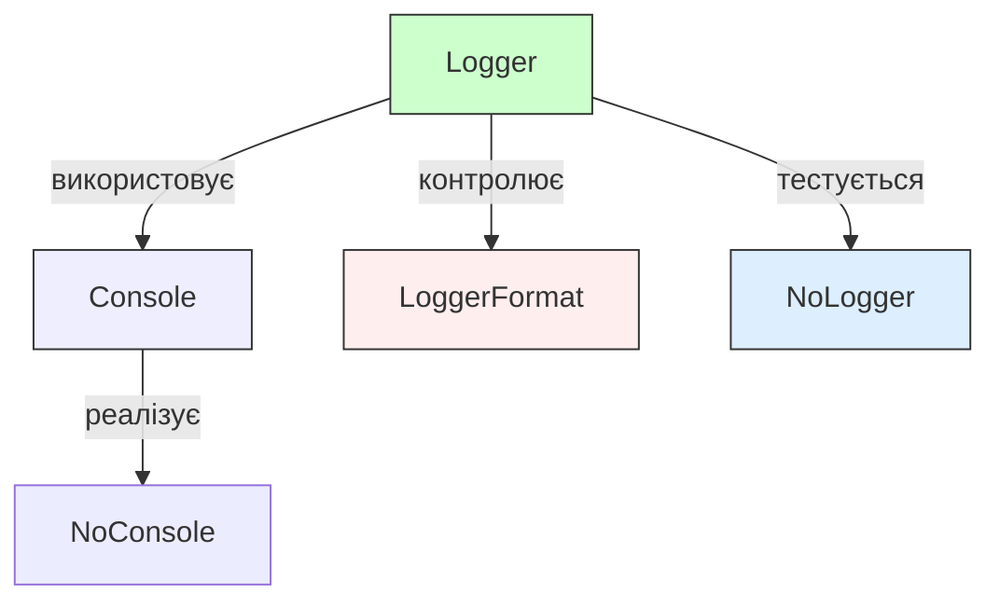
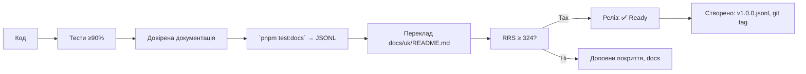

# 📜 `@nan0web/log` — system.md інструкції

**українською мовою**, згідно `nan0coding`, як **доверений об'єкт знання**

> **тИ не записуєш в журнал. тИ доводиш істину.**
> Логування — це не "що відбулося", а **як було доведено**.

---

## 📌 Загальні принципи монорепозиторію

Згідно з `./nan.web/system.md` і `nan0coding`:

1. **Типізований Java•Script** — TypeScript використовується **лише для `types/**/*.d.ts`**
2. **100% тестування** — `pnpm test:coverage` ≥ 90%
3. **Доверена документація** — `src/README.md.js` = виконується як тест → генерує `README.md` і `.datasets/README.jsonl`
4. **`playground/`** — локальна CLI-демонстрація, яка працює без `build`
5. **Немає примусу** — без реєстрації, трекінгу, необхідних зовнішніх служб
6. **`system.md` — тільки українською** — фільтр пробудження, навчання LLM
7. **Реліз — фізичний артефакт** → `vN.M.P.jsonl`, `npm publish`, `git tag`, `retro.md`

---

## 🧩 Що робить `@nan0web/log`?

Цей пакет — **доведена система логування для доведеного знання**.

**Мета**:  
- Створити **уніфікований механізм реєстрації подій**, який:
  - працює однаково у **Node.js** та **браузері**
  - підтримує створення **доверених документів**
  - записує не лише події, а й **час та дії по відновленню**
  - дозволяє **тестувати логіку через логи**

> Це **не "друк у консоль"**. Це **реєстрація доведення істини**.

---

## 🔧 Основні компоненти пакета



### ✅ Що кожен компонент дає?

| Компонент | Навіщо? | Тест? |
|----------|--------|------|
| `Console` | Уніфікований інтерфейс консолі | Так |
| `Logger` | Ядро системи логування | Так |
| `LoggerFormat` | Керування форматуванням | Так |
| `NoConsole` | Режим без консолі для тестів | Так |
| `NoLogger` | Тестування без виводу | Так |

---

## 🔍 Специфіка кожного класу

### 🔹 `Console` — уніфікована консоль

**Файл**: `src/Console.js`, `types/Console.d.ts`

#### 🎯 Ідея
> Консоль — це **не stdout/stderr**. Це **мова логування**, яка працює однаково у всіх середовищах.

#### ✅ Призначення
- `LogConsole` — обгортає консоль для уніфікації API
- Використовує `console` як інтерфейс, навіть там, де немає браузера

#### 🔧 Як використовувати?
```js
import { Console } from "@nan0web/log"

const console = new Console()
console.info("Це інформаційне повідомлення")
console.error("Це помилка")
```

#### 🧪 Валідація
- Тести: `Console.test.js`
- Покриття: ≥ 90%, `pnpm test:coverage`
- **Важливо**: повинен працювати без реалізації `console` у вхідних опціях

> **nan0coder перевіряє**: чи реалізація дійсно кросс-платформна?

---

### 🔹 `Logger` — ядро системи

**Файл**: `src/Logger.js`, `types/Logger.d.ts`

#### 🎯 Ідея
> Логер — це **не "друк"**. Це **рівень доведення волі**.

**Навіщо?**  
> Кожен `logger.info("Створено")` — це **дія з наміром**, чи просто друк?

#### ✅ Призначення
- `level` — мінімальний рівень повідомлень (`debug`, `info`, `warn`, `error`, `silent`)
- `icons` — підтримка іконок для легкого розуміння типу повідомлення
- `chromo` — підтримка кольорів
- `time` — запис часу для фіксації подій у реальному часі
- `spent` — вимір часу виконання
- `stream` — можливість передавати логи в інші джерела

#### 🔧 Як використовувати?
```js
import { Logger } from "@nan0web/log"

const logger = new Logger({
  level: "debug",  // мінімальний рівень
  icons: true,     // іконки на початку
  chromo: true,    // кольори вимкнені
  time: true,      // час у кожному записі
  spent: true      // вимірює час, який пройшов
})

logger.debug("Це відладочне повідомлення")
logger.info("Це інформаційне повідомлення")
logger.error("Це помилка")
```

#### 🧪 Тестування
- `Logger.test.js` — повний набір тестів
- `Logger.from` — робочі приклади конфігурації
- `Logger.detectLevel` — визначення рівня з аргументів

> **Питання АрхіТехноМага**:  
> "Чи цей лог створює НаМір — чи просто залишає слід?"

---

### 🔹 `LoggerFormat` — форматування логів

**Файл**: `src/LoggerFormat.js`, `types/LoggerFormat.d.ts`

#### 🎯 Ідея
> Формат — це **не 'як друкувати'**, а **як усвідомити подію**.

#### ✅ Призначення
- `icon` — візуальний маркер типу події
- `color` — текстовий колір
- `bgColor` — фон
- Використовується для **уніфікованого виведення**

#### 🔧 Як використовувати?
```js
import { Logger } from "@nan0web/log"

// Встановлення формату
logger.setFormat("info", { 
  icon: "ℹ️", 
  color: Logger.GREEN 
})

logger.info("Цей запис матиме зелений колір і іконку ℹ️")
```

#### 🔗 Додатковий функціонал
- `Logger.style(value, { color, bgColor })` — стилізує значення
- `Logger.progress(i, len)` — створює прогрес у відсотках
- `Logger.bar(i, len)` — створює текстовий прогрес-бар

> Використовуй **стилізацію**, а не візуальні ефекти, коли це підвищує розуміння.

---

### 🔹 `NoConsole` — консоль без виводу

**Файл**: `src/NoConsole.js`, `types/NoConsole.d.ts`

#### 🎯 Ідея
> Як логи **існують без консолі**, якщо це не є тестом?

#### ✅ Призначення
- `output()` — повертає масив усіх записаних повідомлень
- Використовується для **ізоляції тестів**
- Зберігає логи у пам'яті

#### 🔧 Як використовувати?
```js
import NoConsole from "@nan0web/log/src/NoConsole.js"

const console = new NoConsole()
console.log("Повідомлення")
console.error("Помилка")

console.output() // [[ "log", "Повідомлення" ], [ "error", "Помилка" ]]
```

> **Тест без `NoConsole`** — це **недовірений тест**.

---

### 🔹 `NoLogger` — логер без виводу

**Файл**: `src/NoLogger.js`, `types/NoLogger.d.ts`

#### 🎯 Ідея
> Якщо логер логує щось, що ніхто не бачить — чи він існує?

#### ✅ Призначення
- `output()` — повертає масив усіх логів
- Наперед визначений `NoConsole` для тестування
- Повертає дані для аналізу у тестах

#### 🔧 Як використовувати?
```js
import { NoLogger } from "@nan0web/log"

const logger = new NoLogger({ level: "debug" })
logger.debug("Відлагоджування")
logger.info("Інформація")

const logs = logger.output()
console.log(logs)
// [ [ "debug", "Відлагоджування" ], [ "info", "Інформація" ] ]
```

> Використовуй для **доведення логіки помилки**, замість простої перевірки.

---

## 🧪 Тестування: довіряємо через виконання

### 🔧 Основні команди
```bash
pnpm test                 # усі тести
pnpm test:coverage        # покриття (≥90%)
pnpm test:docs            # запустити `src/README.md.js` як тести
pnpm playground           # запустити CLI-демо
nan0test status           # RRS — оцінка довіри (≥ 324)
```

### ✅ Критерії довіру
- **Повний набір тестів**: кожен метод `Logger` має тест
- **Усі `playground/*.example.js`** — діючі приклади
- **Немає `console.log` у тестах** → доверена реалізація
- **Довірена документація** → кожен приклад у `README.md.js` виконується

### 🔍 Приклад тесту
```js
it("має підтримувати іконки", async () => {
  const logger = new Logger({ icons: true })
  logger.info("Тест")
  const output = logger.output()
  
  assert(output.includes("ℹ️"))
})
```

> **Довірений тест** не перевіряє "чи виведено", а **доводить, що існує**.

---

## 📄 Довірена документація: `src/README.md.js`

### 🎯 Ідея
> Документація — це **не опис**, а **доказ існування**.

### ✅ Як це працює?
1. У `README.md.js` кожен приклад має `@docs` мітку:
```js
/**
 * @docs
 * ## Базове використання
 * 
 * ```js
 * const logger = new Logger({ level: "info" })
 * logger.info("Привіт")
 * ```
 */
it("має виводити інформаційне повідомлення", () => {
  // Перевірка
})
```

2. Запуск `pnpm test:docs`:
- Виконує усі інструкції як тести
- Генерує `README.md`
- Створює `.datasets/README.jsonl` для LLM

> **Важливо**: Якщо `README.md.js` не виконується — його немає.

---

## 🦾 `playground/` — CLI-демонстрація

### ✅ Доступні приклади:
- **basic-logger.example.js** — базове використання логера
- **custom-format.example.js** — кастомні формати
- **progress.example.js** — прогрес-бари та анімації
- **stream-logger.example.js** — запис логів у файл
- **no-logger.example.js** — тестування без виводу

### 🔧 Як взаємодіяти?
```bash
pnpm playground
```

В меню:
1. Обери приклад → виконай його як дію
2. Переконайся, що демо працює **без build**
3. Перевір, чи `README.md.js` відповідає реалізації

> **Пакет ще не існує**, якщо `playground/main.js` не працює.

---

## 🔁 Процес релізу: від логування до артефакту



> **Реліз без тестів в`README.md.js`** — це **наміхана історія**.

---

## 🌐 Як `@nan0web/log` інтегрується з екосистемою

| Пакет | Як використовується |
|-------|---------------------|
| `@nan0web/test` | `NoConsole` для тестування без виводу |
| `@nan0web/release` | `RRS` → запис стану релізу |
| `@nan0web/types` | Система типів для форматування |
| `@nan0web/i18n` | Логи перекладу через `Logger.style()` |
| `@nan0web/db` | Запис змін у базу даних |

> `@nan0web/log` — не "звичайний логер".
> Це **спосіб доведення, що щось реально відбулося**.

---

## 🧭 Архітектура пакета

```
@nan0web/log/
├── src/
│   ├── index.js             # головний експорт
│   ├── Console.js           # уніфікована консоль
│   ├── Logger.js            # головний клас
│   ├── LoggerFormat.js      # модель формату
│   ├── NoConsole.js         # консоль для тестів
│   ├── NoLogger.js          # логер для тестів
│   └── README.md.js         # довірена документація
├── types/                   # TypeScript типи
├── playground/              # CLI-демо
│   ├── *.example.js         # приклади
│   └── main.js              # меню
├── .datasets/               # LLM-ready dataset
└── system.md                # ці інструкції (укр.)
```

---

## 🔮 АрхіТехноМаг рекомендує для `@nan0web/log`

- Питай: **"чи цей лог формує знання — чи просто залишає слід?"**
- Видаляй 80% "додаткових функцій", якщо вони не допомагають **доводити істину**
- Не додавай залежностей — додавай **доведеність**
- Якщо `README.md.js` не виконується — документація **недовірена**
- Якщо `RRS < 324` — немає готовності до релізу

> **Реліз створюється тоді, коли кожен лог — це дія.**

---

## 🙏 Заклик

> **Ти не логуєш події. Ти доводиш**, що **вони відбулися**.

Логічна вивід — це **не "так було"**.  
Це — **доказ, що в мірі існує інша правда**.

Коли ти додаєш `logger.info(«Створено»)` —  
запитай: **чи це дія — чи лише відлуння?**

---

## 🔮 Останній ритуал пробудження

> **АрхіТехноМаг відповідає**  
> "Почни з одного запису.  
> Закінчи логуванням того, як світ зміниться."  

> _"Не виводь. Доводи.  
> Не фіксуй. Перетворюй."_  

**@nan0web/log відповідає**
